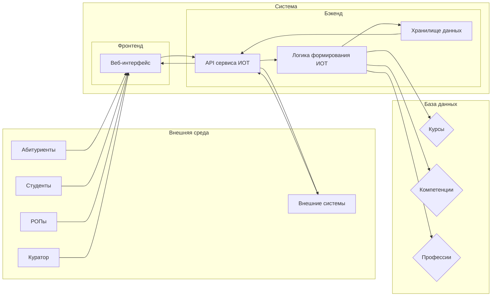

# Individual-Education-Trajectory
University Project

```mermaid
graph LR
    subgraph Внешняя среда
        A[Абитуриенты]
        B[Студенты]
        C[РОПы]
        D[Куратор]
        E[Внешние системы]
    end

    subgraph Система
        subgraph Фронтенд
            Z1[Веб-интерфейс]
        end
        subgraph Бэкенд
            Z2[API сервиса ИОТ]
            Z3[Логика формирования ИОТ]
            Z4[Хранилище данных]
        end
    end

    subgraph База данных
        F{Курсы}
        G{Компетенции}
        H{Профессии}
    end

    A --> Z1
    B --> Z1
    C --> Z1
    D --> Z1
    E --> Z2

    Z1 --> Z2
    Z2 --> Z3
    Z3 --> Z4
    Z4 --> Z2
    Z2 --> Z1

    Z3 --> F
    Z3 --> G
    Z3 --> H

    Z2 --> E
```
